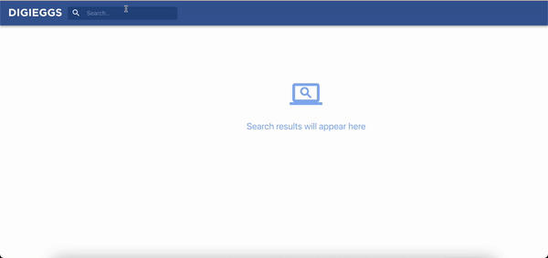

<br />
<p align="center">

  <h3 align="center">Github Search App</h3>

  <p align="center">
    Simple search application to quickly find repos. 
    To be added: search users, bookmark repos, show repo details.
    <br />
    ·
    <a href="https://github.com/iremlaya/github-search/issues">Report Bug or Request Feature</a>
    ·
  </p>
</p>


<!-- TABLE OF CONTENTS -->
<details open="open">
  <summary><h2 style="display: inline-block">Table of Contents</h2></summary>
  <ol>
    <li>
      <a href="#about-the-project">About The Project</a>
      <ul>
        <li><a href="#built-with">Built With</a></li>
      </ul>
    </li>
    <li>
      <a href="#getting-started">Getting Started</a>
      <ul>
        <li><a href="#prerequisites">Prerequisites</a></li>
        <li><a href="#installation">Installation</a></li>
      </ul>
    </li>
    <li><a href="#roadmap">Roadmap</a></li>
    <li><a href="#contact">Contact</a></li>
  </ol>
</details>


<!-- ABOUT THE PROJECT -->
## Demo



### Built With/Implemented Technologies

* `react-router-dom`
* `GitHub API`
* `material-ui`
* `eslint`
* `useContext` for state management
* `TypeScript`
* `React Hooks`    


<!-- GETTING STARTED -->
## Getting Started

To get a local copy up and running follow these simple steps.

### Prerequisites

* npm
  ```sh
  npm install npm@latest -g
  ```
* Optional: yarn
  ```sh
  npm install --global yarn
  ```

### Installation

1. Clone the repo
   ```sh
   git clone https://github.com/iremlaya/github-search.git
   ```
2. Install NPM packages. I prefer Yarn.
   ```sh
   yarn install
   ```
3. Start the project.
    ```sh
   yarn start
   ```


<!-- ROADMAP -->
## Roadmap

 * Adding User search
 * Changing the state objects with multiple search types in mind
 * Possibly using Redux and useReducer; since it gets too complicated with the context; and it's not the main purpose of it.
 * Add bookmarking feature; with a bookmarked value attached to the results.
 * Refactor and decouple the code. The logic is all over the place.
 * Re-write css and styling; only use inline or css.


<!-- CONTACT -->
## Contact

Irem Kaya - iremlcaya@gmail.com

